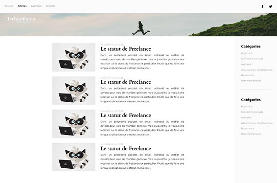

# Solar System Planets

This project is a fully responsive webpage dedicated to presenting the planets of our Solar System. Each planet is showcased with a brief description and an accompanying illustration to enhance the user experience.

## Features

- **Responsive Design:** The webpage is designed to look great on all devices, from mobile phones to desktops.
- **Sticky Navbar:** A sticky navigation bar allows users to easily navigate through the page.
- **Planet Descriptions:** Each planet is introduced with a short, informative paragraph.
- **Illustrations:** Basic images accompany each description to provide visual appeal.

## Technologies Used

- **HTML5:** For the structure of the page.
- **CSS3:** For styling, including responsiveness and the sticky navbar.

## Screenshots

## Contributing

Contributions are welcome! If you'd like to suggest a feature or report a bug, please open an issue or submit a pull request.