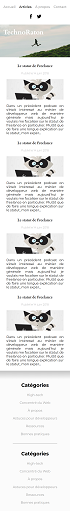
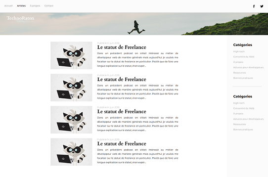

# TechnoRaton

Discover **TechnoRaton**, a high-tech blog concept animated by a raccoon passionate about technology! This prototype showcases the visual design of a blog dedicated to tech news, tips, reviews, and innovations for staying connected to the future.

## Features

- **Responsive Design:** The prototype adapts seamlessly to all screen sizes, from mobile devices to desktops, using Flexbox for layout.
- **Sticky Navbar:** A fixed navigation bar for smooth browsing in desktop view.
- **Clean Visual Layout:** A minimalist and modern design to highlight the content effectively.
- - **Mobile-First Design:** Developed with a mobile-first approach for optimal performance and usability on smaller devices.

## Technologies Used

- **HTML5:** For the structure and semantic elements.
- **CSS3:** For the styling, responsive design, and layout with Flexbox.

## Demo

The prototype is live and accessible online via GitHub Pages:
[**TechnoRaton Live Demo**](<https://simoncassan.github.io/DWWM-2024_2025_Integration_de_maquettes/Technoraton/>)

## Screenshots

## Known Issues

- **Low Contrast:** The color palette used in the prototype may result in low contrast for some text and UI elements, which could impact accessibility for users with visual impairments.
